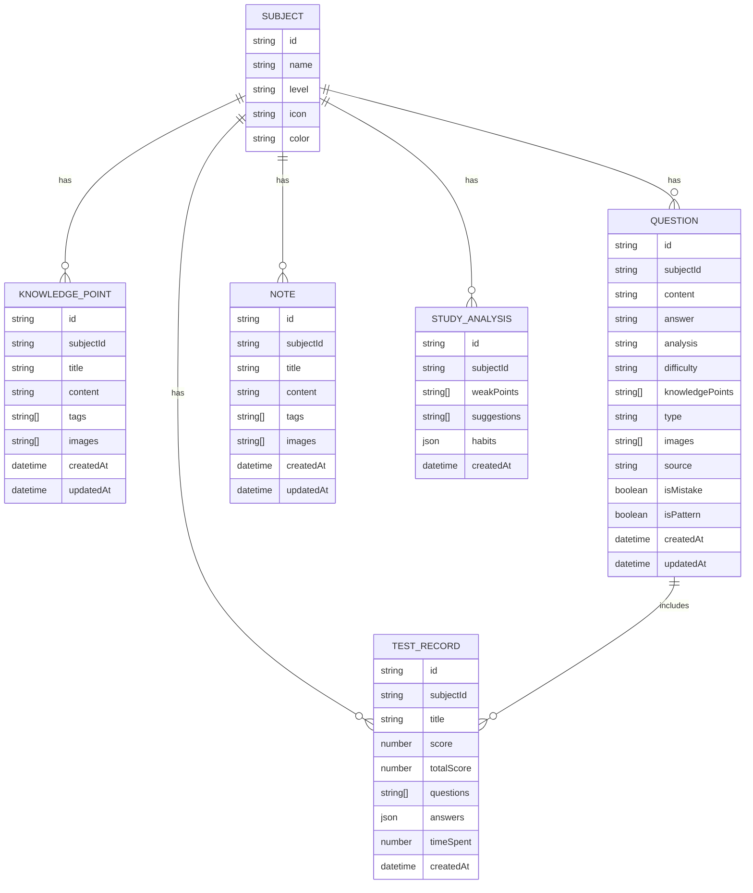

## 1. Architecture Design

```mermaid
graph TB
    subgraph Frontend
        A[React 18]
        B[React Router]
        C[Tailwind CSS]
        D[Zustand]
        E[Recharts]
        F[KaTeX]
    end
    
    subgraph Backend
        G[Express.js]
        H[Supabase Auth]
    end
    
    subgraph Database
        I[(Supabase PostgreSQL)]
        J[Supabase Storage]
    end
    
    subgraph External
        K[Web Scraping API]
        L[MathJax CDN]
    end
    
    A --&gt; B
    A --&gt; C
    A --&gt; D
    A --&gt; E
    A --&gt; F
    A --&gt; G
    G --&gt; H
    G --&gt; I
    G --&gt; J
    G --&gt; K
    F --&gt; L
```

## 2. Technology Description
- **Frontend**: React@18 + TypeScript + Tailwind CSS@3 + Vite + PWA
- **State Management**: Zustand
- **Routing**: React Router DOM
- **Charts**: Recharts
- **Math Rendering**: KaTeX
- **Backend**: Express.js + TypeScript
- **Database**: Supabase (PostgreSQL)
- **Storage**: Supabase Storage
- **Auth**: Supabase Auth
- **Cross-platform Support**: PWA (Windows, macOS, Android, iOS)

## 3. Route Definitions
| Route | Purpose |
|-------|---------|
| / | 首页 - 学科选择和功能导航 |
| /dashboard | 学习仪表盘 |
| /knowledge | 知识归纳 |
| /notes | 学习笔记 |
| /memorize | 必背必记 |
| /mistakes | 错题整理 |
| /patterns | 母题整理 |
| /same-point | 同考点归拢 |
| /test | 模拟测试 |
| /practice | 做题模式 |
| /scores | 分数历史 |
| /analysis | 学习分析 |
| /mindmap | 思维导图 |

## 4. API Definitions

### 4.1 数据类型定义
```typescript
interface Subject {
  id: string;
  name: string;
  level: 'primary' | 'middle' | 'high' | 'university';
  icon: string;
  color: string;
}

interface KnowledgePoint {
  id: string;
  subjectId: string;
  title: string;
  content: string;
  tags: string[];
  images: string[];
  createdAt: Date;
  updatedAt: Date;
}

interface Question {
  id: string;
  subjectId: string;
  content: string;
  answer: string;
  analysis: string;
  difficulty: 'easy' | 'medium' | 'hard';
  knowledgePoints: string[];
  type: 'single' | 'multiple' | 'fill' | 'essay';
  images: string[];
  source: string;
  isMistake: boolean;
  isPattern: boolean;
  createdAt: Date;
  updatedAt: Date;
}

interface Note {
  id: string;
  subjectId: string;
  title: string;
  content: string;
  tags: string[];
  images: string[];
  createdAt: Date;
  updatedAt: Date;
}

interface TestRecord {
  id: string;
  subjectId: string;
  title: string;
  score: number;
  totalScore: number;
  questions: string[];
  answers: Record&lt;string, string&gt;;
  timeSpent: number;
  createdAt: Date;
}

interface StudyAnalysis {
  id: string;
  subjectId: string;
  weakPoints: string[];
  suggestions: string[];
  habits: Record&lt;string, any&gt;;
  createdAt: Date;
}
```

### 4.2 API Endpoints
| Method | Path | Description |
|--------|------|-------------|
| GET | /api/subjects | 获取学科列表 |
| GET | /api/knowledge | 获取知识列表 |
| POST | /api/knowledge | 创建知识点 |
| PUT | /api/knowledge/:id | 更新知识点 |
| DELETE | /api/knowledge/:id | 删除知识点 |
| GET | /api/questions | 获取题目列表 |
| POST | /api/questions | 创建题目 |
| PUT | /api/questions/:id | 更新题目 |
| DELETE | /api/questions/:id | 删除题目 |
| POST | /api/questions/classify | 自动分类题目 |
| GET | /api/notes | 获取笔记列表 |
| POST | /api/notes | 创建笔记 |
| PUT | /api/notes/:id | 更新笔记 |
| DELETE | /api/notes/:id | 删除笔记 |
| GET | /api/tests | 获取测试记录 |
| POST | /api/tests | 创建测试记录 |
| GET | /api/analysis | 获取学习分析 |
| POST | /api/mindmap | 生成思维导图 |
| POST | /api/scrape | 网络采集知识 |

## 5. Server Architecture Diagram

```mermaid
graph LR
    A[Routes] --&gt; B[Controllers]
    B --&gt; C[Services]
    C --&gt; D[Repositories]
    D --&gt; E[(Database)]
    C --&gt; F[External APIs]
```

## 6. Data Model

### 6.1 Data Model Definition



### 6.2 Data Definition Language

```sql
-- 学科表
CREATE TABLE subjects (
    id UUID PRIMARY KEY DEFAULT gen_random_uuid(),
    name VARCHAR(100) NOT NULL,
    level VARCHAR(20) NOT NULL CHECK (level IN ('primary', 'middle', 'high', 'university')),
    icon VARCHAR(50),
    color VARCHAR(20),
    created_at TIMESTAMPTZ DEFAULT NOW(),
    updated_at TIMESTAMPTZ DEFAULT NOW()
);

-- 知识点表
CREATE TABLE knowledge_points (
    id UUID PRIMARY KEY DEFAULT gen_random_uuid(),
    subject_id UUID NOT NULL,
    title VARCHAR(200) NOT NULL,
    content TEXT NOT NULL,
    tags TEXT[],
    images TEXT[],
    created_at TIMESTAMPTZ DEFAULT NOW(),
    updated_at TIMESTAMPTZ DEFAULT NOW()
);

-- 题目表
CREATE TABLE questions (
    id UUID PRIMARY KEY DEFAULT gen_random_uuid(),
    subject_id UUID NOT NULL,
    content TEXT NOT NULL,
    answer TEXT,
    analysis TEXT,
    difficulty VARCHAR(20) NOT NULL CHECK (difficulty IN ('easy', 'medium', 'hard')),
    knowledge_points TEXT[],
    type VARCHAR(20) NOT NULL CHECK (type IN ('single', 'multiple', 'fill', 'essay')),
    images TEXT[],
    source VARCHAR(200),
    is_mistake BOOLEAN DEFAULT FALSE,
    is_pattern BOOLEAN DEFAULT FALSE,
    created_at TIMESTAMPTZ DEFAULT NOW(),
    updated_at TIMESTAMPTZ DEFAULT NOW()
);

-- 笔记表
CREATE TABLE notes (
    id UUID PRIMARY KEY DEFAULT gen_random_uuid(),
    subject_id UUID NOT NULL,
    title VARCHAR(200) NOT NULL,
    content TEXT NOT NULL,
    tags TEXT[],
    images TEXT[],
    created_at TIMESTAMPTZ DEFAULT NOW(),
    updated_at TIMESTAMPTZ DEFAULT NOW()
);

-- 测试记录表
CREATE TABLE test_records (
    id UUID PRIMARY KEY DEFAULT gen_random_uuid(),
    subject_id UUID NOT NULL,
    title VARCHAR(200) NOT NULL,
    score NUMERIC NOT NULL,
    total_score NUMERIC NOT NULL,
    questions UUID[],
    answers JSONB,
    time_spent INTEGER,
    created_at TIMESTAMPTZ DEFAULT NOW()
);

-- 学习分析表
CREATE TABLE study_analysis (
    id UUID PRIMARY KEY DEFAULT gen_random_uuid(),
    subject_id UUID NOT NULL,
    weak_points TEXT[],
    suggestions TEXT[],
    habits JSONB,
    created_at TIMESTAMPTZ DEFAULT NOW()
);

-- 启用 RLS
ALTER TABLE subjects ENABLE ROW LEVEL SECURITY;
ALTER TABLE knowledge_points ENABLE ROW LEVEL SECURITY;
ALTER TABLE questions ENABLE ROW LEVEL SECURITY;
ALTER TABLE notes ENABLE ROW LEVEL SECURITY;
ALTER TABLE test_records ENABLE ROW LEVEL SECURITY;
ALTER TABLE study_analysis ENABLE ROW LEVEL SECURITY;

-- 基础权限
GRANT SELECT ON subjects TO anon;
GRANT SELECT ON subjects TO authenticated;
GRANT ALL PRIVILEGES ON subjects TO authenticated;

GRANT SELECT ON knowledge_points TO anon;
GRANT ALL PRIVILEGES ON knowledge_points TO authenticated;

GRANT SELECT ON questions TO anon;
GRANT ALL PRIVILEGES ON questions TO authenticated;

GRANT SELECT ON notes TO anon;
GRANT ALL PRIVILEGES ON notes TO authenticated;

GRANT SELECT ON test_records TO anon;
GRANT ALL PRIVILEGES ON test_records TO authenticated;

GRANT SELECT ON study_analysis TO anon;
GRANT ALL PRIVILEGES ON study_analysis TO authenticated;
```

### 6.3 初始数据

```sql
-- 插入预定义学科
INSERT INTO subjects (name, level, icon, color) VALUES
-- 小学
('语文', 'primary', 'book-open', '#EF4444'),
('数学', 'primary', 'calculator', '#3B82F6'),
('英语', 'primary', 'languages', '#10B981'),
('科学', 'primary', 'flask', '#F59E0B'),
-- 初中
('语文', 'middle', 'book-open', '#EF4444'),
('数学', 'middle', 'calculator', '#3B82F6'),
('英语', 'middle', 'languages', '#10B981'),
('物理', 'middle', 'zap', '#8B5CF6'),
('化学', 'middle', 'flask', '#F59E0B'),
('生物', 'middle', 'leaf', '#14B8A6'),
('历史', 'middle', 'history', '#EC4899'),
('地理', 'middle', 'globe', '#06B6D4'),
('政治', 'middle', 'landmark', '#6366F1'),
-- 高中
('语文', 'high', 'book-open', '#EF4444'),
('数学', 'high', 'calculator', '#3B82F6'),
('英语', 'high', 'languages', '#10B981'),
('物理', 'high', 'zap', '#8B5CF6'),
('化学', 'high', 'flask', '#F59E0B'),
('生物', 'high', 'leaf', '#14B8A6'),
('历史', 'high', 'history', '#EC4899'),
('地理', 'high', 'globe', '#06B6D4'),
('政治', 'high', 'landmark', '#6366F1'),
-- 大学
('高等数学', 'university', 'calculator', '#3B82F6'),
('线性代数', 'university', 'grid', '#8B5CF6'),
('概率论', 'university', 'dice', '#10B981'),
('大学物理', 'university', 'zap', '#F59E0B'),
('计算机基础', 'university', 'computer', '#06B6D4');
```

## 7. PWA 跨平台支持

### 7.1 PWA 特性
- **可安装**: 可在 Windows、macOS、Android、iOS 上安装为桌面/移动应用
- **离线支持**: Service Worker 缓存核心资源，支持离线使用
- **推送通知**: 支持学习提醒和任务通知
- **自动更新**: 自动检测并更新应用版本
- **全屏体验**: 独立窗口运行，无浏览器地址栏

### 7.2 manifest.json 配置
```json
{
  "name": "智慧学习整理系统",
  "short_name": "智慧学习",
  "description": "全学科学习整理与错题管理平台",
  "start_url": "/",
  "display": "standalone",
  "background_color": "#FFFFFF",
  "theme_color": "#3B82F6",
  "icons": [
    {
      "src": "/icons/icon-192.png",
      "sizes": "192x192",
      "type": "image/png"
    },
    {
      "src": "/icons/icon-512.png",
      "sizes": "512x512",
      "type": "image/png"
    }
  ]
}
```

### 7.3 Service Worker 功能
- 静态资源缓存策略
- API 响应缓存
- 离线回退页面
- 后台同步支持

### 7.4 响应式设计断点
- 移动端: < 768px
- 平板: 768px - 1024px
- 桌面: > 1024px
