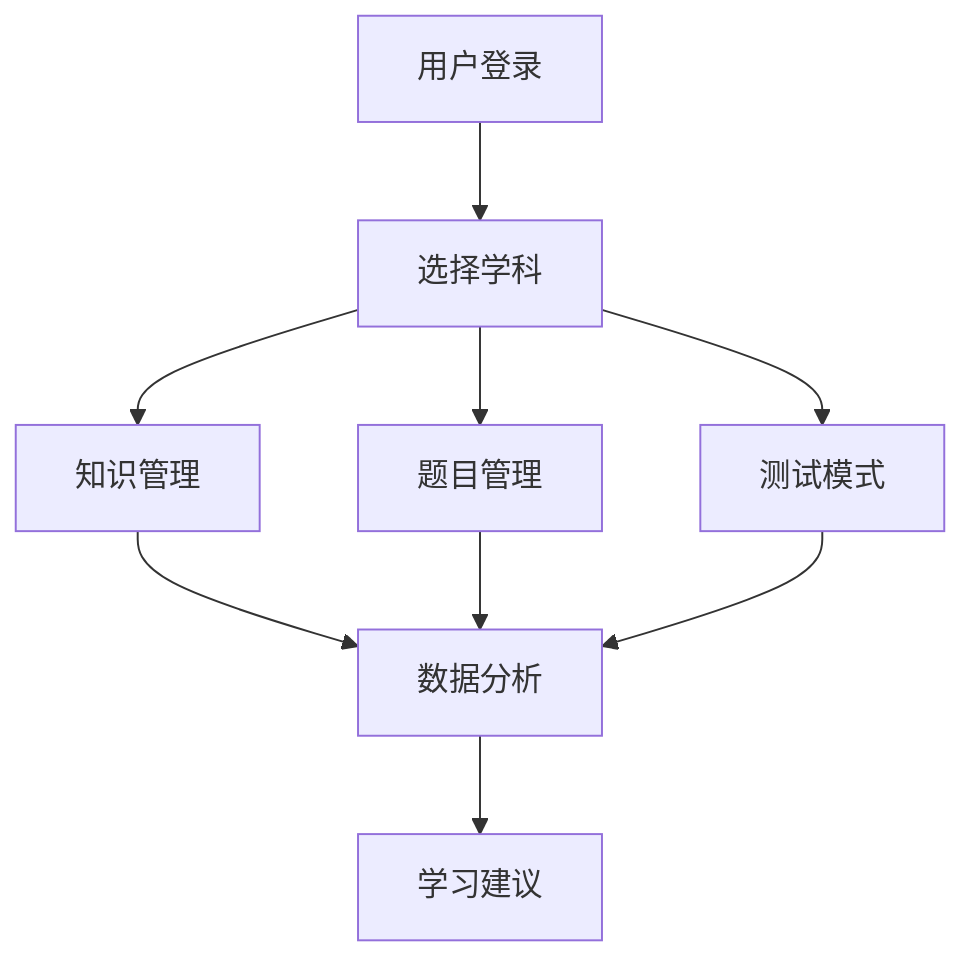

## 1. Product Overview
智慧学习整理系统是一个面向全年龄段学生的综合性学习管理平台，旨在解决知识碎片化、学习效率低、缺乏系统化整理等问题。该产品提供知识归纳、错题管理、智能分析等功能，帮助学生提升学习效果。

## 2. Core Features

### 2.1 User Roles
| Role | Registration Method | Core Permissions |
|------|---------------------|------------------|
| Student | Email/Phone | 使用所有功能，管理个人学习数据 |

### 2.2 Feature Module
1. **主页**：学科导航、功能概览、学习进度
2. **知识管理**：知识归纳、必背必记、学习笔记
3. **题目管理**：错题整理、母题整理、同考点归拢
4. **测试模式**：模拟测试、做题模式
5. **数据分析**：分数历史、薄弱环节分析、学习建议
6. **智能功能**：网络采集、思维导图生成、知识点自动分类

### 2.3 Page Details
| Page Name | Module Name | Feature description |
|-----------|-------------|---------------------|
| 主页 | 学科选择 | 支持小学、初中、高中、大学全学科分类 |
| 主页 | 功能导航 | 快速访问核心功能模块 |
| 知识归纳 | 知识编辑 | 支持富文本、数学公式、图片上传 |
| 错题整理 | 题目录入 | 手动录入或一键网络采集 |
| 错题整理 | 知识点归类 | 自动识别并归类题目知识点 |
| 模拟测试 | 组卷功能 | 按知识点、难度自动组卷 |
| 数据分析 | 分数对比 | 历史成绩可视化对比 |
| 数据分析 | 薄弱点分析 | 基于做题数据智能分析 |
| 思维导图 | 自动生成 | 根据知识结构生成可视化思维导图 |

## 3. Core Process

### 3.1 学习流程
1. 用户登录系统
2. 选择学科和年级
3. 录入或收集学习资料
4. 进行学习和练习
5. 查看分析报告和建议

### 3.2 题目管理流程
1. 手动录入或网络采集题目
2. 系统自动归类知识点和难度
3. 用户可编辑和调整分类
4. 用于错题本、母题集或模拟测试

## 4. User Interface Design

### 4.1 Design Style
- **主色调**：蓝色系（#3B82F6）代表智慧，绿色系（#10B981）代表成长
- **按钮风格**：圆角矩形，带有微阴影和悬停效果
- **字体**：Inter 和 Noto Sans SC（中文支持）
- **布局风格**：卡片式布局，清晰的视觉层次
- **图标**：使用 lucide-react 图标库，风格统一

### 4.2 Page Design Overview
| Page Name | Module Name | UI Elements |
|-----------|-------------|-------------|
| 主页 | 学科导航 | 彩色卡片，悬停缩放动画 |
| 知识归纳 | 编辑器 | 工具栏、公式编辑器、图片上传 |
| 错题整理 | 列表视图 | 筛选、排序、标签、难度标识 |
| 模拟测试 | 答题界面 | 计时器、进度条、题目导航 |
| 数据分析 | 图表区域 | 柱状图、折线图、雷达图 |
| 思维导图 | 可视化区域 | 可拖拽节点、缩放控制 |

### 4.3 Responsiveness
- Desktop-first设计，适配1024px以上屏幕
- 平板和移动端自适应布局
- 触摸操作优化

### 4.4 性能优化
- 组件懒加载
- 图片压缩和懒加载
- 本地存储缓存常用数据
- 虚拟滚动处理长列表
